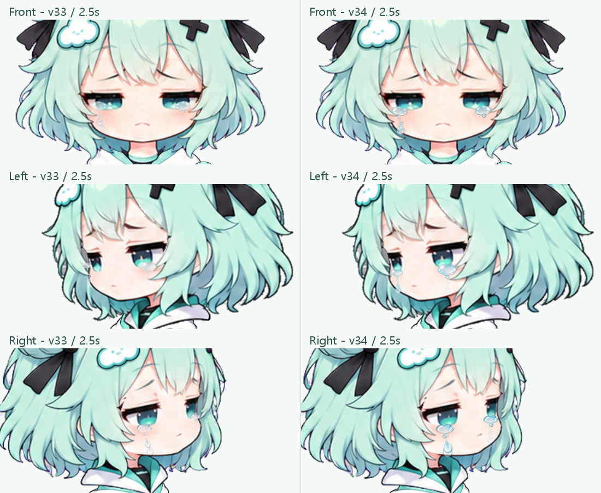
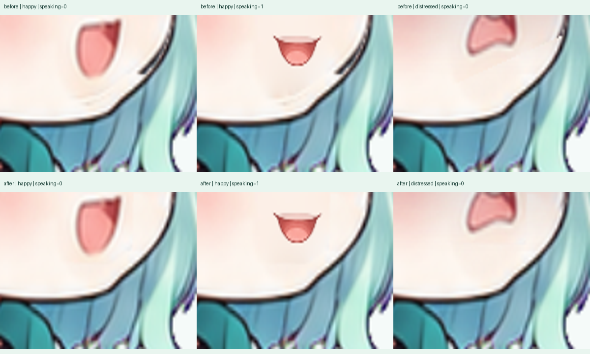

# Cloudy 눈물·입 주변 잔여선 변경

2026-10-04 제작·검증, 2026-10-05 커밋 정리. 기존 v30 동작을 유지하면서 눈물은 v34 그림으로,
오른쪽 기쁨·괴로움 입옆 잔여선은 v35 그리기 방식으로 수정했습니다.

눈물은 image_gen으로 방향별 그림을 제작하고 256×512 투명 PNG 36장(세 방향·두 눈·여섯 단계)으로 분리했습니다.
눈밑에 맺히는 물과 떨어지는 망울을 더 크게, 면과 테두리를 더 선명하게 그렸습니다.
슬픔·속상함의 실제 눈꺼풀 위치에 맞춰 배치하며, 그림의 종횡비나 모양을 재생 중 변형하지 않습니다.
아래는 같은 2.5초의 v33/v34 비교입니다.

입선은 원화에 남아 있던 옛 턱선과 입꼬리를 정상 얼굴의 같은 위치 피부·턱 영역으로 교체합니다.
원본 삼각형의 위치·UV를 잘라 재사용하며 실제 입술과 흰 테두리, 발화 시간과 몸·팔 동작을 보존합니다.
정면 괴로움·오른쪽 화남 발화도 정리했으며, 최종 오른쪽 기쁨 대기·대화와 괴로움 비교는 아래와 같습니다.
위는 v34, 아래는 v35이며 같은 time=0.76, speechTime=0.41, blink=0 상태입니다.

본 앱의 CloudyRigView와 미리보기는 같은 directional_v5 JS/PNG를 읽습니다.
미리보기 표정 목록은 exports/previews-v35의 45장 WebP를 사용합니다.
본 앱은 눈물 축소 표시를 위한 mipmap과 그 저장량까지 포함한 32MiB GPU 텍스처 캐시 예산을 유지합니다.
이미 실행 중인 본 앱은 재시작해야 변경을 읽습니다. 기존 PNG 재생 모드는 이번 수정 경로가 아닙니다.

최종 v35 검증에서는 실제 Qt OpenGL 렌더 990개 상태 쌍을 비교했습니다.
912쌍은 오른쪽 기쁨·괴로움의 대기 0~4.6초와 발화 0~2.8초를 0.1초 간격으로,
대기·인사·생각 및 눈 감기 고정·자동 조합으로 검사했으며, 78쌍은 다른 13감정 진단입니다.
전체 프레임버퍼 키프레임은 198쌍을 저장했습니다. 임계값 8의 premultiplied RGBA 비교에서
입·턱 허용 영역 밖 차이는 0이었고, 관련 테스트 148개가 통과했습니다.
810개 조합의 기존 포즈·몸·팔·눈물 그리기 데이터와 기존 PNG 1,447개 해시도 보존됐습니다.
실제 사용자 미리보기의 두 표정과 카드 로딩을 확인했습니다.
이는 샘플링한 검증 결과이며 모든 순간의 무결함이나 사용자 승인을 대신하지 않습니다.
전체 main.py 창을 새로 열어 검증한 것은 아니며, 본 앱에서 쓰는 실제 렌더러로 검사했습니다.

관련 테스트: `.venv/Scripts/python.exe -m pytest tests/test_rig_planner.py tests/test_cloudy_texture_cache.py -q`.
전체 캡처·GIF·생성 지시문·백업·직전 구현은 로컬 integration-validation/tears-v31~v35와
이전 textures/tears-v32~v33, exports/previews-v34에 보관했습니다. 해당 대량 자료는 이 커밋에 포함하지 않습니다.
